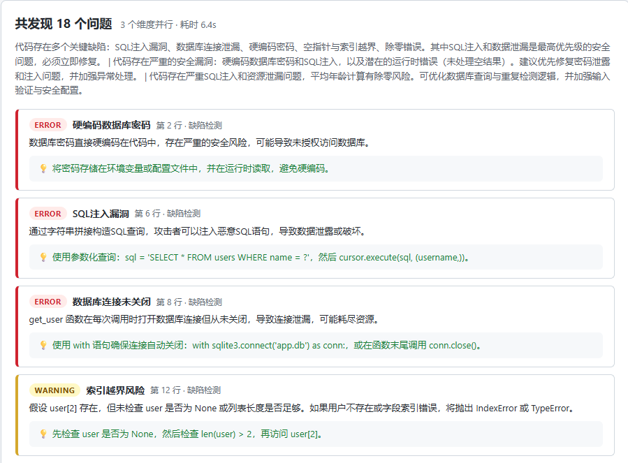

# Code Review Agent

基于 **DeepSeek API** 的多维度代码审查服务，SpringBoot 3 + Java 17。

## 功能

- **多维度并行审查**：bug 检测、安全审计、性能分析，每个维度独立 prompt + 并发调用
- **DeepSeek 驱动**：调用 DeepSeek Chat API，结构化返回问题列表
- **异步并行**：CompletableFuture + 线程池，N 个维度 ≈ 单次 API 耗时
- **容错**：单维度失败不影响其他维度，markdown 代码块自动剥离
- **内置 Web 界面**：单文件页面，粘贴代码即可审查，问题按严重级别着色展示

## 技术栈

| 层 | 技术 |
|---|------|
| 框架 | SpringBoot 3.3.5 |
| 语言 | Java 17 |
| 构建 | Maven |
| HTTP 客户端 | RestTemplate |
| JSON | Jackson (ObjectMapper, TypeReference) |
| 并发 | CompletableFuture + ExecutorService |
| LLM | DeepSeek Chat API |

## 快速启动

```bash
# 1. 设置 API Key
export DEEPSEEK_API_KEY=sk-xxxxxxxx

# 2. 启动（本地开发自动加载 application-local.yml）
cd code-review-agent
mvn spring-boot:run

# 3. 测试
curl -X POST http://localhost:8080/api/review \
  -H "Content-Type: application/json" \
  -d '{
    "code": "def get_user(id):\n    user = db.query(id)\n    return user.name",
    "language": "python",
    "dimensions": ["bug", "security"]
  }'
```

## Web 界面

启动后浏览器访问 `http://localhost:8080/`：粘贴代码 → 选择语言和审查维度 → 点击审查。问题按严重级别着色（ERROR 红 / WARNING 黄 / INFO 蓝），附修复建议。

前端是单文件 `static/index.html`（原生 HTML + JS，无框架），由 Spring Boot 静态资源托管，与后端 API 同源，无需处理 CORS。渲染 LLM 返回内容时统一用 `textContent` 而非 `innerHTML`，避免模型输出中混入标签造成 XSS。



## API

### POST /api/review

**请求体：**

```json
{
  "code": "待审查的代码",
  "language": "python",
  "dimensions": ["bug", "security", "performance"],
  "context": "可选，补充说明"
}
```

**响应体：**

```json
{
  "success": true,
  "issues": [
    {
      "severity": "ERROR",
      "category": "空指针",
      "line": 2,
      "title": "潜在空指针引用",
      "description": "db.query(id) 可能返回 None...",
      "suggestion": "在访问前检查是否为 None"
    }
  ],
  "summary": "维度1总结 | 维度2总结",
  "totalIssues": 2
}
```

**支持的维度：**

| 维度 | 关注点 |
|------|--------|
| `bug` | 逻辑错误、空指针、边界条件、异常处理 |
| `security` | 注入攻击、敏感信息泄露、权限绕过 |
| `performance` | 不必要的循环、重复查询、内存浪费 |

## 项目结构

```
src/main/java/com/zhuhai/codereview/
├── CodeReviewApplication.java        # 启动类
├── controller/
│   └── ReviewController.java         # POST /api/review + 入参校验
├── model/
│   ├── CodeReviewRequest.java        # 请求体（code, language, dimensions）
│   ├── CodeReviewResponse.java       # 响应体（success, issues, summary）
│   └── Issue.java                    # 单个问题（severity, category, line, title...）
└── service/
    ├── DeepSeekClient.java           # RestTemplate 调 DeepSeek API
    └── CodeReviewService.java        # 维度分发 → 并行调用 → 结果合并

src/main/resources/
└── static/
    └── index.html                    # Web 界面（原生 HTML + JS 单文件）
```

## 架构

```
POST /api/review
      │
      ▼
ReviewController  ── 空值校验
      │
      ▼
CodeReviewService.review()
      │
      ├─ CompletableFuture ─ bug       ──► DeepSeekClient ──► DimResult
      ├─ CompletableFuture ─ security  ──► DeepSeekClient ──► DimResult
      └─ CompletableFuture ─ performance──► DeepSeekClient ──► DimResult
      │                                                        │
      └── 并行（exceptionally 兜底）────────────────────────────┘
                              │
                          mergeResults()
                              │
                    去重 + summary 聚合
                              │
                     CodeReviewResponse
```

## 安全

- API Key 使用环境变量或 `application-local.yml`（已 gitignore）
- 主配置文件 `application.yml` 不含真实 Key
- RestTemplate 连接超时 5s，读取超时 30s

## 已知局限

以下是我在真实测试中发现、评估后**决定暂不修复**的问题。记录在这里是因为它们比"能跑"更能说明这个系统的边界。

### 1. 跨维度语义去重不完整

**现象**：同一个问题可能被多个维度重复报出。实测中「硬编码数据库密码」被两个维度各报一次 —— 标题相同，但行号一个是 2、一个是 3；`find_duplicates` 的 O(n²) 问题也被报了两次，两个维度用的标题完全不同。

**原因**：去重 key 是 `line + ":" + title` 的精确匹配。但 LLM 数行号不稳定（空行、import 是否计入没有保证），跨维度生成的标题措辞也各不相同 —— 精确匹配天然抓不住"语义上是同一个问题"的重复。

**权衡过的修法**：

| 方案 | 效果 | 代价 |
|------|------|------|
| key 改成只用 title | 解决行号漂移 | 抓不到不同措辞的语义重复；真正不同行的同名问题反而被误合并 |
| 合并后让 LLM 再做一次去重 pass | 能识别语义重复 | 多一次 API 调用，整体延迟约 +10s |

**决策**：不修。重复 issue 不影响审查结论的正确性，只是结果略冗余；两种修法要么治标不治本，要么显著拖慢响应。如果以后结果要入库做统计，再引入 LLM 去重 pass。

### 2. 维度隔离是软约束

**现象**：bug 维度的 prompt 明确写了"忽略代码风格和性能问题"，实测仍然报出了性能类 issue（"去重算法低效"）。

**原因**：prompt 只是引导，不是硬保证 —— LLM 不严格遵守指令是常态，不能把 prompt 当访问控制用。

**决策**：接受。串味的 issue 本身是真实问题，只是归类不准；要做硬隔离得在合并阶段加后置过滤（关键词或分类器），成本大于收益。
